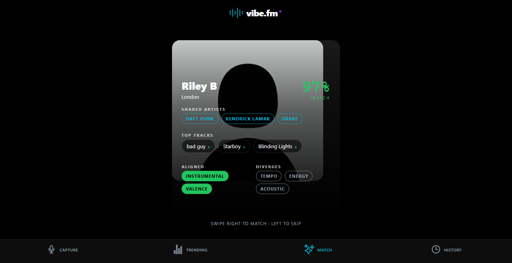

# VibeFM 🚀
### The Audio Intelligence Layer for Music

**"VibeFM tells you what a song *does* — to your body, and to the culture."**

---

## ⚡ The Pitch
Shazam revolutionized how we identify music, but identification is only the surface. In a world of infinite tracks, we don’t just need to know *what* a song is—we need to understand its **Sonic DNA**. 

**VibeFM** is an audio intelligence platform that transforms raw sound into a multi-dimensional sonic fingerprint. Using high-fidelity PCM capture and Gemini-powered semantic analysis, VibeFM decodes the "formula" behind the music, enabling deeper discovery, creator-grade insights, and a new paradigm of **Acoustic Matchmaking**.

---

## ✨ Key Pillars

### 1. Real-Time Sonic Capture
Beyond simple metadata. VibeFM captures live audio and extracts a high-resolution fingerprint:
*   **Acoustic Metadata**: Energy, Valence, Danceability, Tempo, and Key.
*   **Semantic Profiling**: LLM-driven synthesis that maps tracks to curated "Sonic Archetypes" (e.g., *Industrial Grime*, *Ethereal Lo-fi*).
*   **Haptic Pulse**: A proprietary feedback loop that syncs your device's taptic engine to the track's BPM.

### 2. The Soulmate Engine (Acoustic Matchmaking)
Music taste is the ultimate social signal. VibeFM's matchmaking algorithm connects users not just by "genre," but by shared **Acoustic Vectors**. 
*   **Full-Bleed Photo Cards**: A premium swipe experience where profile photography meets frosted data overlays.
*   **Frosted Glass UI**: Song chips and metadata layers rendered with high-fidelity blur and transparency for a modern, "glassmorphism" aesthetic.
*   **Sonic Compatibility**: Match with "Sonic Soulmates" who share your preference for specific energy levels and instrumental textures.
*   **Contextual Feedback**: Dynamic background tinting and giant icon indicators that react to your swipe intent in real-time.

### 3. The Analysis Dashboard
A "Lab Instrument" interface for music.
*   **Trending Localized Charts**: See what’s pulsing in your city (Montreal-localized).
*   **The Acoustic Recipe**: Every track features a deep-tissue breakdown of its qualitative and quantitative properties, from micro-genre classification to spectral descriptions.

---

## 🛠️ The Tech Stack
Built for performance, precision, and a "Dark Cinema" aesthetic.

*   **Mobile Core**: Expo SDK 54 (Continuous Native Generation) + React Native.
*   **Intelligence Layer**: Gemini Flash 2.5 via OpenRouter for real-time semantic simulation and qualitative synthesis.
*   **Audio Engineering**: 
    -   `@siteed/expo-audio-stream` for low-latency PCM capture.
    -   Custom Python pipeline (`librosa`, `Demucs`) for offline source separation and feature extraction.
*   **Animation**: 60fps gesture-driven UI powered by Reanimated and Moti.

---

## 📈 The Opportunity
VibeFM isn't just a consumer app; it's an **Intelligence Layer**.

*   **For Listeners**: A discovery tool that understands *why* you like what you like.
*   **For Creators**: An "Acoustic Recipe" tool to analyze trending formulas and reverse-engineer hit tracks.
*   **For Labels**: Granular data on the sonic profiles currently trending in specific micro-locations.

---

## 🎨 Aesthetic: "Modern Dark Cinema x Lab Instrument"
The UI is designed to feel like a premium piece of studio gear. 
*   **Palette**: Deep `#000000` backgrounds with Cyan, Purple, and Green accents.
*   **Visuals**: High-fidelity waveform rings, glassmorphism overlays, and haptic-synced animations.

---

## 🚀 Vision: What's Next
- [ ] **On-Device Stem Separation**: Bringing Demucs inference to the edge.
- [ ] **B2B Creator Tools**: Direct export of "Acoustic Recipes" to DAW-ready formats.
- [ ] **Sonic Rooms**: Real-time social listening rooms based on live fingerprint matching.

---
*Built for Hack the Mountain — Arts + CADUM Mobile Category.*
*Developed with a focus on Audio Intelligence and Native Performance.*
